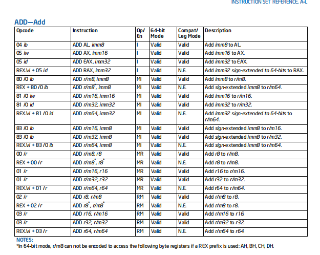
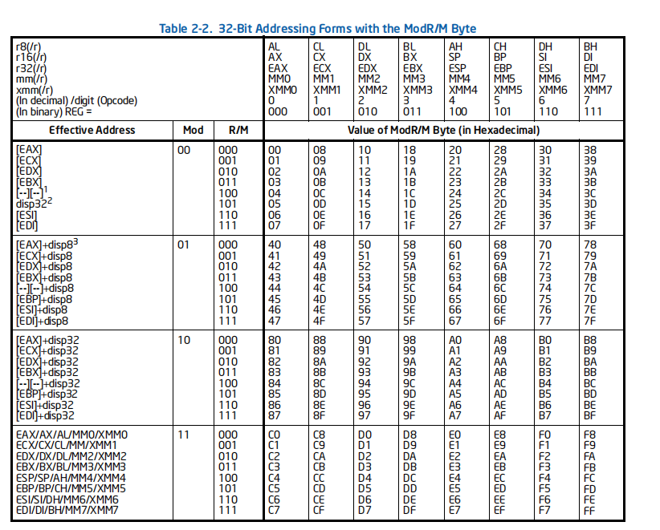
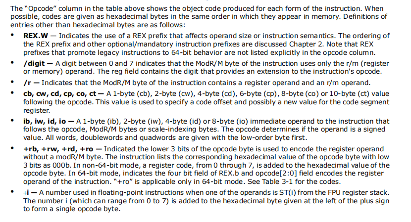
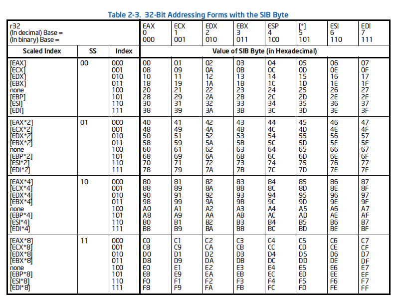

## INTEL 编码规则简述

### 前言

因为汇编器的编写基础——汇编转机器码的编码方式（即Opcode的编码格式）是最重要的一环，因此理解编码规则是编写整个项目的基础。

**参考文献**：[Intel® 64 and IA-32 Architectures Software Developer’s Manual](https://www.intel.com/content/dam/www/public/us/en/documents/manuals/64-ia-32-architectures-software-developer-instruction-set-reference-manual-325383.pdf)

[Intel Pentium Instruction Set Reference (A) (tripod.com)](https://faydoc.tripod.com/cpu/index_a.htm)

**参考资料**：

[X86 指令格式及编码解析 (IA32 Mode)_Ross7的博客-CSDN博客_x86指令前缀](https://blog.csdn.net/ross1206/article/details/81661804)

[OpCode教程_ljfth的博客-CSDN博客](https://blog.csdn.net/ljfth/article/details/6432779)

[fpu,mmx以及sse寄存器的少量简介_analogous_love的博客-CSDN博客](https://blog.csdn.net/analogous_love/article/details/9103861)

[OPCode详解及汇编与反汇编原理_sqzxwq的博客-CSDN博客_opcode](https://blog.csdn.net/sqzxwq/article/details/47786345)

[汇编指令之OpCode快速入门_BRUCE董的博客-CSDN博客](https://blog.csdn.net/q187543/article/details/77334643)

### Opcode基本的编码格式

完整的Opcode由图示六个byte field构成（其中只有code部分为必须）

- **Prefixes**：code 前缀有LOCK、REP等，本项目所涉及到的指令不需要前缀，因此可略过
- **Opcode**：最重要的一环，有操作码、操作数类型决定，可由表中查询

​		示例：

​		ADD EAX，EBX 对应ADD r32, r/m32 所以

​		opcode 为 03 

> （表中/r ib等标识符为MOD R/M以及SIB索引中使用）

- **MOD R/M**

  - 该模式提供索引，定位所需要的寄存器

  

​			如果我们需要定位EAX，则可定位到 mod 00 R/M 000

​			/digit 0 REG = 000 位置

​			再按照/digit MOD REG R/M 的方式组合到一起即可

​			

- **注**

  - 在MOD R/M中，当R/M = 100 时，意为该opcode有SIB Bytes，可由此在SIB中获取相应的byte表示

    ；pic：mod

  - 在查询Opcode时，会给出/digit值，由此在Mod表中查询，常见的digit值如下

    - digit 0 ~ 7 对应表格中 0 -7列
    - /r  （/r表示同时使用寄存器和r/m域信息）
    - +rd +rw等， 此时表示不需要ModRM bytes，寄存器信息由opcode低三位附加表示。（例如：用到eax 而eax对应值为000b，则opcode + 000b为最终code值）

- **SIB**

  SIB提供基于base+scale*index的寻址方式 （例如：[ESI+EBX\*4])

  同样在表中获取索引即可

  

​		SS INDEX BASE 即 10 011 110

- **DISPLACEMENT**

  即mod表中的dis，表示增加的偏移量

  例：mov ecx, dword ptr ds:[1288174]

  ​		add eax, [esi+12]

- **IMMEDIATE**

  表示立即数
  
  
  
  
  
  ### 方法示例
  
  **对于[instruct] [op1] [op2]形式的汇编指令：**
  
  - 首先记录 instruct 类型， op1、op2类型及大小（reg、r/m、imm、offset）
  - 根据以上获取的信息，到相应的opcode表中查询，获取opcode值以及/digit值
  - 判断是否需要ModR/M bytes，如果需要，根据op1 op2类型到相应表中查询
  - 判断是否有SIB bytes，若有则在Mod R/M中选择SIB相应的编码，再在SIB表中找到对应编码
  - 如果有偏移量，则加上偏移量
  - 如果有立即数，在最后加上立即数（1、2、4byte根据opcode对应类型决定）
  
  
  
  ​	
  
  
  
  
  
  
  
  
  
  